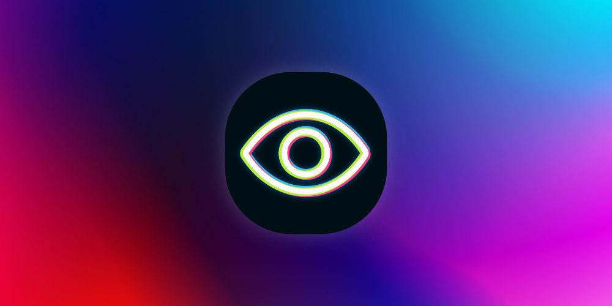
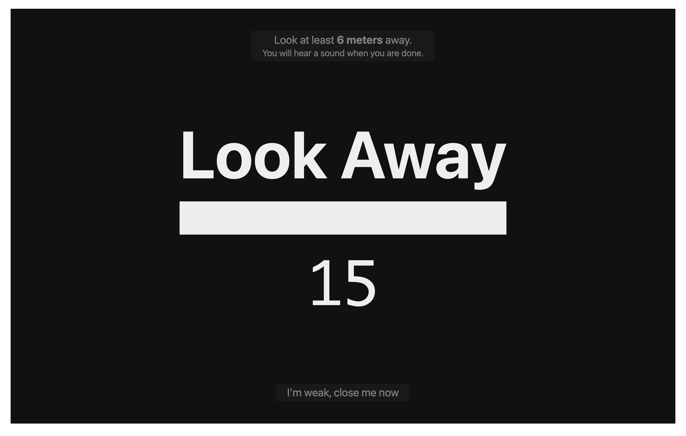

# UnPixel

Help your eyes take a break

## 🤔 Why?

When staring for long times at computer screen our eyes can get dry and suffer form what is called Computer Vision Syndrome (CVS).

To combat and alleviate the symptoms there is the famous 20/20/20 rule that aims at reducing the stress on our eyes caused by focusing for long periods on the same distance.

This is not medical advice. Read more [here](https://en.wikipedia.org/wiki/Computer_vision_syndrome) and [here](https://www.aoa.org/healthy-eyes/eye-and-vision-conditions/computer-vision-syndrome).

## 📦 Installation

Head to the [release page](https://github.com/cupcakearmy/unpixel/releases) and grab the latest for your platform.

- For `macOS` you can downlaod the `.dmg` image.
- For `Windows` download the `.exe`.
- For `Linux` either the `.AppImage` or `.deb`, you will know what fits you 😉.

## Building / Development

1. Clone the repo
2. `yarn install`
3. `yarn dist` to build for all platforms

Alternatevly you can run `yarn build` and the `yarn electron-builder -m` for `macOS`, `-l` fir `linux` or `-w` for `windows`.
